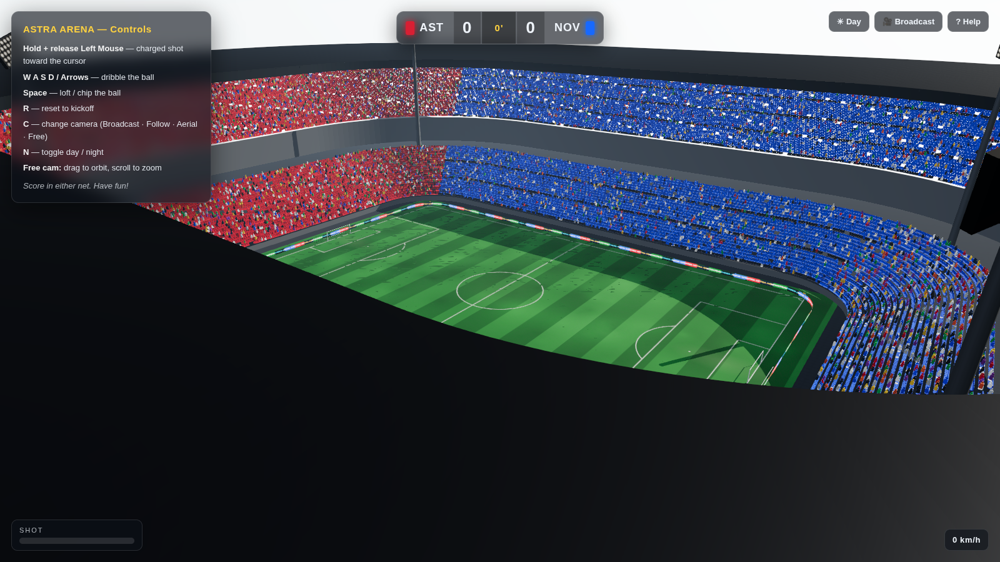
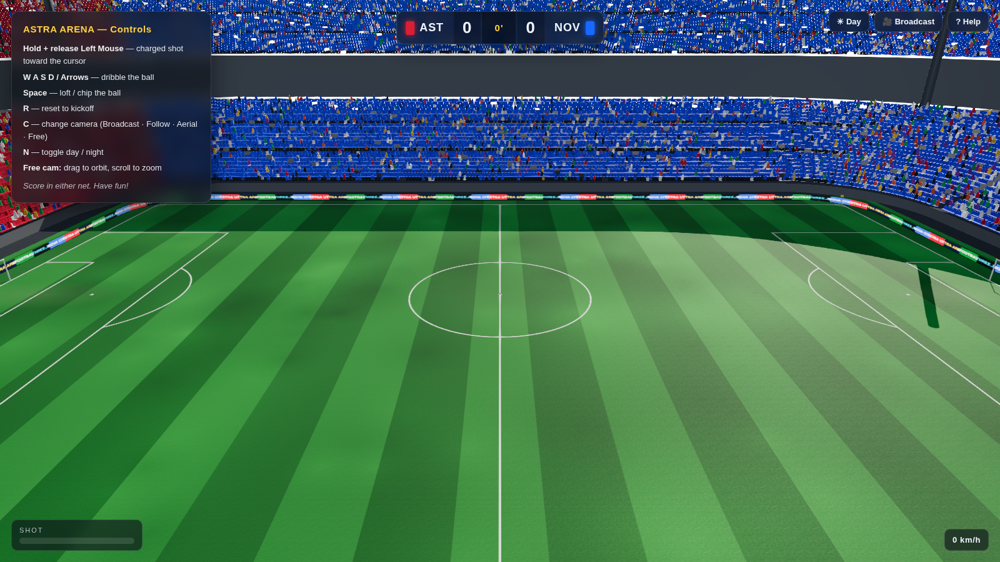
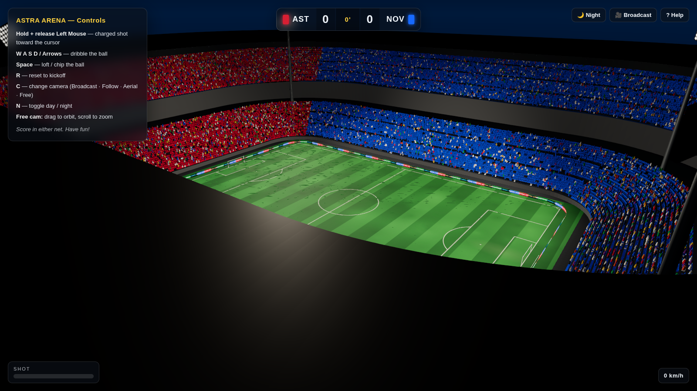

# ⚽ Astra Arena — 3D Football Stadium (JavaScript / Three.js)

A photoreal, **playable** 3D football stadium rendered entirely in the browser
with [Three.js](https://threejs.org/). Regulation pitch, a full two‑tier seating
bowl with a club‑coloured crowd, a cantilever roof, floodlights, animated LED
advertising boards, day/night lighting — and a ball you can actually shoot,
dribble and score with.

It's built to look and feel like a console stadium (the kind you'd see in
*eFootball* / *FIFA*) while being 100% web tech — no Unity, no Blender exports,
every asset generated procedurally in code.



| Broadcast (day) | Floodlit night |
| --- | --- |
|  |  |

---

## ✨ Features

### The pitch (graphics-first)
- **Regulation IFAB markings** drawn to exact metric measurements — centre circle
  (9.15 m), penalty areas (16.5 m), goal areas, penalty arcs & spots, corner arcs.
- **Realistic turf**: procedurally generated mowing stripes, organic colour
  mottling, goalmouth & centre‑circle wear, plus tiled **normal + roughness maps**
  so sunlight and floodlights rake across the grass.
- **Goals** with round posts, crossbars and a slanted, sagging mesh net.

### The stadium
- **Two‑tier seating bowl** built around a rounded‑rectangle perimeter —
  **~57,000 instanced seats** in a single draw call.
- **Crowd mosaics**: club‑coloured sections, banded patterns and a seat‑art
  *tifo* that spells the home club's name across the main stand.
- **Instanced 3D spectators** filling the stands.
- **Cantilever roof** with structural ribs, a hanging fascia and an under‑roof
  **LED light bank**.
- **Four floodlight pylons** with emissive lamp arrays and real spotlights.
- **Animated LED perimeter boards** with scrolling sponsor hoardings.
- Dugouts, corner flags and a concrete apron.

### Rendering ("the engine look")
- PBR materials, **ACES Filmic** tone mapping, sRGB output.
- Real‑time **shadows**, a physical **Sky** + image‑based reflections (PMREM).
- Post‑processing: **UnrealBloom**, **SMAA** anti‑aliasing.
- **Day / Night** mode with a gradient night dome, stars and a floodlit pitch.
- Automatic graceful degradation on software/headless GL.

### Gameplay
- Full arcade **ball physics**: gravity, turf bounce, rolling friction with
  matching spin, aerodynamic drag, reflective walls and **goal‑post collisions**.
- **Goal‑line detection**, live scoreboard with match clock, goal celebration
  and kickoff.
- Four cameras: **Broadcast**, **Follow**, **Aerial** and free **Orbit**.

---

## 🎮 Controls

| Input | Action |
| --- | --- |
| **Hold + release Left Mouse** | Charged shot toward the cursor |
| **W A S D / Arrows** | Dribble the ball |
| **Space** | Loft / chip the ball |
| **R** | Reset to kickoff |
| **C** | Cycle camera (Broadcast · Follow · Aerial · Free) |
| **N** | Toggle day / night |
| **Free cam** | Drag to orbit, scroll to zoom |

---

## 🚀 Running it

Requires [Node.js](https://nodejs.org/) 18+.

```bash
npm install      # install dependencies (three, vite)
npm run dev      # start the dev server
```

Then open the printed URL (defaults to <http://localhost:5173>).

### Production build

```bash
npm run build    # bundle to dist/
npm run preview  # serve the production build
```

> **Tip:** for the full visual experience (bloom + sky reflections) run it in a
> browser with hardware WebGL. On software renderers those effects are skipped
> automatically and the scene falls back to the analytic lights.

---

## 🧱 Project structure

```
src/
├─ main.js                 # bootstrap: renderer, loop, wiring
├─ config.js               # all dimensions, palette & quality knobs
├─ core/
│  ├─ Environment.js       # sky, sun, lights, fog, day/night, IBL
│  └─ PostFX.js            # bloom + SMAA + ACES output chain
├─ stadium/
│  ├─ Stadium.js           # assembles the whole arena (staged loading)
│  ├─ Pitch.js / PitchTexture.js   # turf + line-marking generation
│  ├─ Goals.js             # posts, crossbars, nets
│  ├─ Stands.js / standMath.js     # instanced seating bowl + tifo
│  ├─ Roof.js              # cantilever roof + LED bank
│  ├─ Crowd.js             # instanced spectators
│  ├─ Floodlights.js       # corner pylons + spotlights
│  ├─ AdBoards.js          # scrolling LED hoardings
│  └─ Surroundings.js      # ground, dugouts, corner flags
├─ game/
│  ├─ Ball.js              # ball mesh + classic panel texture
│  ├─ Physics.js           # bounce / roll / drag / collisions / goals
│  ├─ Gameplay.js          # input, shooting, scoring, kickoff
│  └─ CameraRig.js         # broadcast / follow / aerial / orbit
├─ ui/HUD.js               # scoreboard, power meter, goal banner, loader
└─ utils/                  # geometry + async helpers
```

`tools/screenshot.mjs` is an optional Playwright helper for capturing renders
headlessly.

---

## 📜 License

MIT — have fun building on it.
